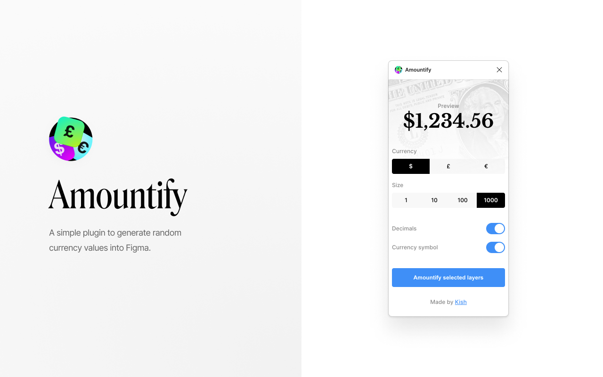

# Random Numberizer

A simple plugin to generate random currency values into Figma, made by [Kish Patel](https://kishpatel.com).



## Setup

This plugin template uses Typescript and NPM, two standard tools in creating JavaScript applications.

First, download [Node.js](https://nodejs.org/en/download/) which comes with NPM. This will allow you to install TypeScript and other libraries.

Next, install TypeScript using the command:

```
  npm install -g typescript
```

Finally, in the directory of your plugin, get the latest type definitions for the plugin API by running:

```
  npm install --save-dev @figma/plugin-typings
```

Use VS Code for development so your code auto-compiles `code.ts` into `code.js`. 

Within VS Code: 

- Run the "Terminal > Run Build Task..." menu item
- Then select `tsc: watch - tsconfig.json`.

You will have to do this again every time you reopen Visual Studio Code.

That's it!